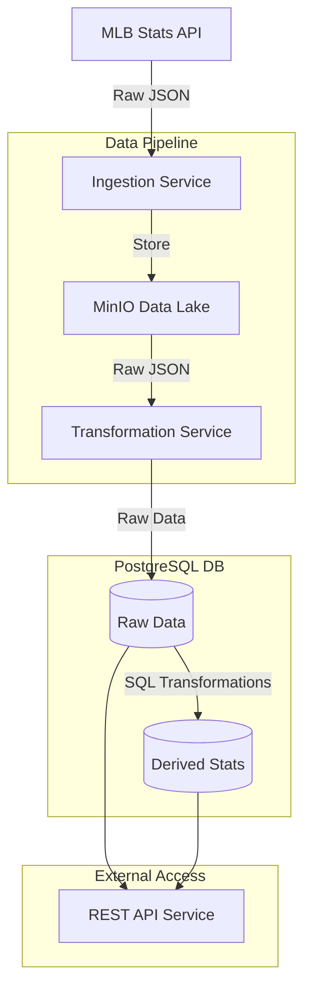
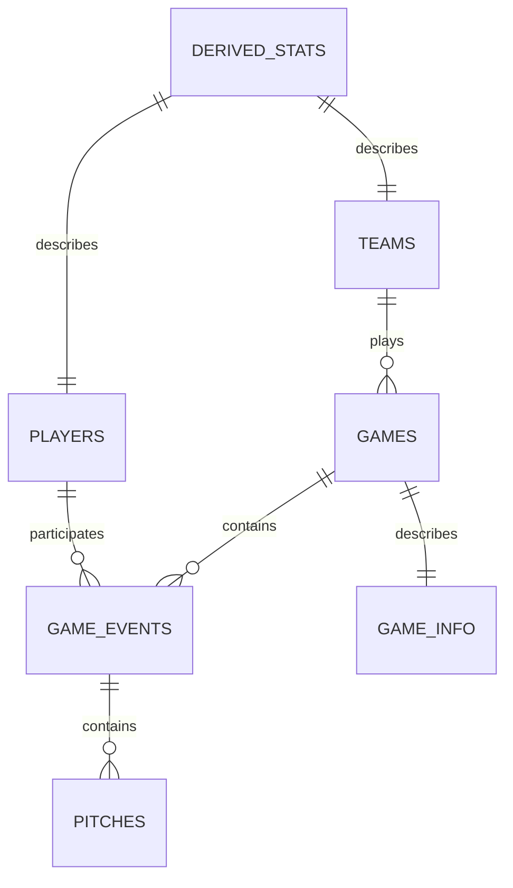

# MLB Statistics Tracking System (STS) - Project Plan

## Project Overview
A comprehensive baseball statistics system that ingests MLB data in real-time, processes it through an ELT pipeline, and provides a robust API for data access. The system is designed to serve as a foundation for future analysis and visualization projects.

## Table of Contents

1. [Project Structure](#1-project-structure)
   - [Directory Structure](#directory-structure)
   - [Architecture Diagram](#architecture-diagram)

2. [Phase 1: Core Infrastructure](#2-phase-1-core-infrastructure)
   1. [Data Pipeline Components](#1-data-pipeline-components)
      - [Ingestion Service](#ingestion-service)
      - [Transformation Service](#transformation-service)
      - [Database Design](#database-design)
   2. [Initial Features](#2-initial-features)
      - [Core Database Tables](#core-database-tables)
   3. [API Integration](#3-api-integration)
      - [API Design Principles](#api-design-principles)
      - [Core API Endpoints](#core-api-endpoints)
      - [Data Flow Patterns](#data-flow-patterns)

3. [Development Principles](#3-development-principles)
   1. [Version Control](#1-version-control)
   2. [Testing Strategy](#2-testing-strategy)
   3. [Documentation](#3-documentation)
   4. [Monitoring and Logging](#4-monitoring-and-logging)

4. [Development Environments and CI/CD](#4-development-environments-and-cicd)
   - [Development Environments](#development-environments)
   - [CI/CD Pipeline Structure](#cicd-pipeline-structure)
   - [Development Workflow](#development-workflow)
   - [Environment Configuration](#environment-configuration)
   - [Quality Gates](#quality-gates)

5. [Implementation Plan](#5-implementation-plan)
   - [Phase 1: Core Infrastructure](#phase-1-core-infrastructure-1)
   - [Phase 2: Basic Features](#phase-2-basic-features)
   - [Phase 3: API Enhancement](#phase-3-api-enhancement)

6. [Quality Assurance](#6-quality-assurance)
   - [Testing Requirements](#testing-requirements)
   - [Documentation Requirements](#documentation-requirements)

7. [Deployment Strategy](#7-deployment-strategy)
   - [Container Organization](#container-organization)
   - [Environment Configuration](#environment-configuration-1)

8. [Monitoring and Maintenance](#8-monitoring-and-maintenance)
   - [Health Checks](#health-checks)
   - [Backup Strategy](#backup-strategy)

9. [Future Projects](#9-future-projects)
   - [MLB Stats Analysis Project](#mlb-stats-analysis-project)
   - [MLB Stats Dashboard Project](#mlb-stats-dashboard-project)

## 1. Project Structure

### Directory Structure
```
dsuite/
├── .github/
│   └── workflows/               # CI/CD pipelines
├── docs/
│   ├── CHANGELOG.md            # Track major changes
│   ├── GOALS.md               # Project goals and milestones
│   └── architecture/           # Architecture diagrams and docs
├── services/
│   ├── ingestion/             # MLB API data ingestion service
│   │   ├── Dockerfile
│   │   ├── requirements.txt
│   │   ├── src/
│   │   │   ├── historical.py  # Historical data ingestion
│   │   │   └── live.py        # Live data ingestion
│   │   └── tests/
│   ├── transformation/         # Data transformation service
│   │   ├── Dockerfile
│   │   ├── requirements.txt
│   │   ├── src/
│   │   │   ├── schema/        # Database schema definitions
│   │   │   ├── raw/          # Raw data transformations
│   │   │   └── derived/      # Derived statistics
│   │   └── tests/
│   ├── minio/                 # MinIO data lake service
│   │   ├── Dockerfile
│   │   ├── config/
│   │   │   └── minio.json    # MinIO server configuration
│   │   └── init/
│   │       └── create-buckets.sh  # Bucket initialization script
│   ├── postgres/              # PostgreSQL database service
│   │   ├── Dockerfile
│   │   ├── init/
│   │   │   ├── 01-init.sql   # Database initialization
│   │   │   └── 02-schemas.sql # Schema definitions
│   │   └── config/
│   │       └── postgresql.conf # PostgreSQL configuration
│   └── api/                   # REST API service
│       ├── Dockerfile
│       ├── requirements.txt
│       ├── src/
│       │   └── routes/
│       └── tests/
├── scripts/
│   ├── schema_analysis/       # JSON schema analysis tools
│   └── setup/                 # Setup and initialization scripts
├── tests/
│   ├── integration/
│   └── e2e/
├── .env.example
├── docker-compose.yml
└── README.md
```

### Architecture Diagram


## 2. Phase 1: Core Infrastructure

### 1. Data Pipeline Components

#### Ingestion Service
- Separate modules for historical and live data
- Rate limiting and error handling
- Metadata tracking for ingestion status
- MinIO storage organization by year/month/day

#### Transformation Service
- Schema validation and evolution
- Raw data transformations
- Derived statistics calculations
- Independent operation from ingestion

#### Database Design
- Schema-first approach
- Separate schemas for raw and derived data
- Optimized indexing strategy
- Version control for schema changes

### 2. Initial Features

#### Core Database Tables
```mermaid
classDiagram
    %% MLB Game Data Schema
    %% Essential entities and relationships
    direction TB
    %% Central entity representing a baseball game
    class Game {
    }

    %% Baseball team participating in games
    class Team {
        +int away.springLeague.id
        +str away.springLeague.name
        +str away.springLeague.abbreviation
        +int away.springLeague.id
        +int away.division.id
    }

    %% Baseball player on a team
    class Player {
        +int player.id
        +str player.fullName
        +str player.primaryPosition.code
        +str player.primaryNumber
    }

    %% Individual play within a game
    class Play {
        +int player.id
    }

    %% Stadium where games are played
    class Venue {
        +int id
        +str name
    }

    %% Essential relationships
    Game *--|has 2| Team
    Game -->|played at| Venue
    Team o--|rosters| Player
    Game *--|contains| Play
    Play -->|involves| Player
    Team -->|home field| Venue
```



### 3. API Integration

#### API Design Principles
- RESTful endpoints following OpenAPI 3.0 specification
- Versioned API paths (e.g., `/api/v1/`)
- JWT-based authentication and role-based access control
- Rate limiting and request throttling
- Comprehensive error handling and status codes
- Consistent response formats
- Query parameter support for filtering and pagination
- Caching headers and ETags for performance
- CORS configuration for web security

#### Core API Endpoints
```
GET /api/v1/games
  - Current and scheduled games
  - Historical game lookup
  - Game state and live updates

GET /api/v1/stats
  - Player statistics
  - Team statistics
  - Derived metrics
  - Historical trends

GET /api/v1/players
  - Player information
  - Career statistics
  - Current status

GET /api/v1/teams
  - Team information
  - Season statistics
  - Roster data
```

#### Data Flow Patterns
1. **Real-time Updates**
   - WebSocket connection for live game data
   - Server-Sent Events for alerts
   - Polling fallback for compatibility

2. **Data Caching**
   - API response caching
   - Database query caching
   - In-memory data stores

3. **Error Handling**
   - Graceful degradation
   - Retry with exponential backoff
   - Comprehensive error logging
   - Monitoring alerts

4. **Performance Optimization**
   - Query optimization
   - Connection pooling
   - Load balancing
   - Performance monitoring

## 3. Development Principles

### 1. Version Control
- Each project maintains its own repository
- Feature branch workflow
- Semantic versioning
- Comprehensive commit messages

### 2. Testing Strategy
- Unit tests per service
- Integration tests between services
- End-to-end tests for critical paths
- Performance testing

### 3. Documentation
- API documentation (OpenAPI)
- Setup guides
- Integration guides
- Deployment procedures

### 4. Monitoring and Logging
- Centralized logging
- Error tracking
- Performance metrics
- Audit trails

## 4. Development Environments and CI/CD

### Development Environments
- Local development environment
- Staging environment
- Production environment

### CI/CD Pipeline Structure
- Continuous Integration (CI)
- Continuous Deployment (CD)

### Development Workflow
- Feature development
- Code review
- Unit testing
- Integration testing
- Deployment

### Environment Configuration
- Configuration management
- Environment-specific settings
- Dependency injection

### Quality Gates
- Code quality checks
- Security scans
- Performance benchmarks
- Compliance checks

## 5. Implementation Plan

### Phase 1: Core Infrastructure
1. Basic ingestion service
2. Storage setup
3. Simple API endpoints
4. Initial testing

### Phase 2: Basic Features
1. Core database tables
2. API integration
3. Data flow patterns
4. Error handling

### Phase 3: API Enhancement
1. Query optimization
2. Connection pooling
3. Load balancing
4. Performance monitoring

## 6. Quality Assurance

### Testing Requirements
- Unit tests
- Integration tests
- End-to-end tests
- Performance tests

### Documentation Requirements
- API documentation
- Setup guides
- Integration guides
- Deployment procedures

## 7. Deployment Strategy

### Container Organization
```yaml
# docker-compose.pipeline.yml
version: '3.8'
services:
  ingestion:
    build: ./services/ingestion
    environment:
      - MLB_API_KEY=${MLB_API_KEY}

  minio:
    image: minio/minio
    volumes:
      - minio_data:/data

  postgres:
    image: postgres:latest
    volumes:
      - pg_data:/var/lib/postgresql/data

  api:
    build: ./services/api
    ports:
      - "8000:8000"
```

### Environment Configuration
- Container orchestration
- Environment-specific configurations
- Dependency injection

## 8. Monitoring and Maintenance

### Health Checks
- Service availability
- API response times
- Data freshness
- Error rates

### Backup Strategy
- Database backups
- MinIO backups
- Configuration backups
- Restore procedures

## 9. Future Projects

### MLB Stats Analysis Project
A separate project that will build upon the core pipeline to provide advanced statistical analysis:

1. **Key Features**
   - Advanced player metrics
   - Team performance analysis
   - Predictive modeling
   - Custom statistical frameworks
   - Research environment with Jupyter notebooks
   - Model validation framework
   - Simulation capabilities

2. **Integration Points**
   - API access to raw and derived data
   - Export pipeline for analysis results
   - Scheduled jobs for regular analysis
   - Event-driven analysis triggers

3. **Technology Stack**
   - Python for statistical analysis
   - R for specialized baseball statistics
   - PostgreSQL for result storage
   - Redis for caching
   - Docker for deployment

### MLB Stats Dashboard Project
A visualization layer built with R Shiny to provide interactive access to statistics:

1. **Key Features**
   - Interactive data visualization
   - Custom report generation
   - Real-time game tracking
   - Historical data analysis
   - User customization
   - Export capabilities

2. **Integration Points**
   - API integration with core pipeline
   - Real-time data updates
   - Authentication services
   - Export functionality

3. **Technology Stack**
   - R Shiny for dashboard
   - PostgreSQL for data access
   - Redis for caching
   - Docker for deployment

Both future projects will maintain their own repositories and deployment pipelines while integrating seamlessly with the core pipeline through well-defined APIs and data contracts.
