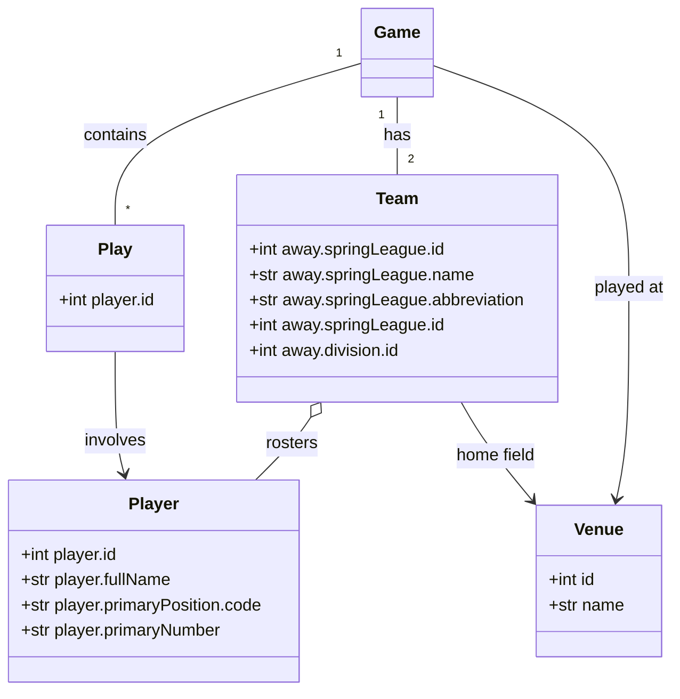

# MLB Statistics Tracking System (STS)

A comprehensive baseball statistics system that ingests MLB data in real-time, processes it through an ELT pipeline, and provides a robust API for data access. The system serves as a foundation for future analysis and visualization projects.

## 🏗️ Project Structure

```
dsuite/
├── .github/
│   └── workflows/        # CI/CD pipelines
├── docs/
│   ├── schema/          # Database schema documentation
│   └── architecture/    # Architecture diagrams and docs
├── services/
│   ├── ingestion/       # MLB API data ingestion service
│   ├── transformation/  # Data transformation service
│   ├── minio/          # MinIO data lake service
│   ├── postgres/       # PostgreSQL database service
│   └── api/           # REST API service
├── scripts/
│   ├── schema_analysis/ # Schema analysis tools
│   └── setup/          # Setup scripts
└── tests/              # Test suite
```

## 🚀 Getting Started

### Prerequisites

- Python 3.11+
- Docker and Docker Compose
- MinIO
- PostgreSQL

### Development Setup

1. Clone the repository:
```bash
git clone https://github.com/cyngerian/dsuite.git
cd dsuite
```

2. Create and activate virtual environment:
```bash
python -m venv venv
source venv/bin/activate  # On Windows: venv\Scripts\activate
```

3. Install dependencies:
```bash
pip install -r requirements.txt
```

4. Install pre-commit hooks:
```bash
pre-commit install
```

5. Start services:
```bash
docker-compose up -d
```

## 🧪 Development

### Code Quality

We use several tools to maintain code quality:

- **black**: Code formatting
- **flake8**: Style guide enforcement
- **mypy**: Static type checking
- **pytest**: Testing framework
- **pre-commit**: Git hooks for code quality

### Running Tests

```bash
pytest
```

### Type Checking

```bash
mypy .
```

## 📊 Data Pipeline

### Core Data Model


1. **Ingestion Service**
   - Real-time MLB data ingestion
   - Historical data backfilling
   - Data validation and error handling

2. **Transformation Service**
   - Raw data processing
   - Schema validation
   - Derived statistics calculation

3. **Storage**
   - MinIO for raw data lake
   - PostgreSQL for processed data
   - Optimized query patterns

4. **API Service**
   - RESTful endpoints
   - Real-time game updates
   - Historical data access

## 📝 Documentation

- [Project Status](PROJECT_STATUS.md)
- [Current Progress](CURRENT_PROGRESS.md)
- [Plan vs. Implementation Analysis](PLAN_VS_IMPLEMENTATION.md)
- [MinIO Setup](MINIO_SETUP.md)
- [Project Plan](PROJECT_PLAN.md)
- [Ingestion Model](docs/INGESTION_MODEL.md)
- [Message Bus Plan](docs/MESSAGE_BUS_PLAN.md)
- [Goals](docs/GOALS.md)

## 🤝 Contributing

1. Fork the repository
2. Create your feature branch
3. Commit your changes (following our commit message conventions)
4. Push to the branch
5. Open a Pull Request

### Commit Message Format

We follow the [Conventional Commits](https://www.conventionalcommits.org/) specification:

- `feat:` New features
- `fix:` Bug fixes
- `docs:` Documentation changes
- `style:` Code style changes
- `refactor:` Code refactoring
- `test:` Test updates
- `chore:` Maintenance tasks

## 📄 License

This project is licensed under the MIT License - see the LICENSE file for details.

## 🔄 Project Status

See [PROJECT_STATUS.md](PROJECT_STATUS.md) for current status and recent updates.
