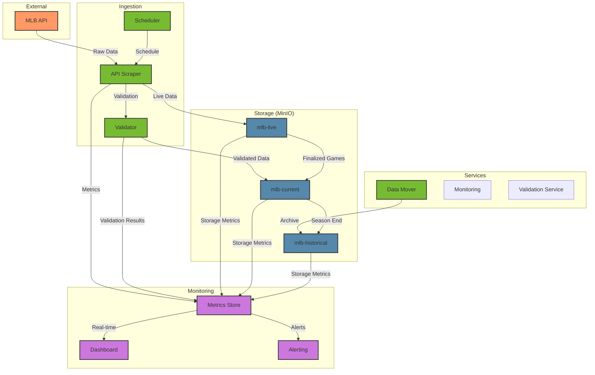

# MLB Data Ingestion Model

## Overview
The MLB Statistics Tracking System (STS) employs a sophisticated data ingestion model that handles different phases of the baseball season and various data states. The system is designed to manage pre-season, regular season, and post-season data through a carefully orchestrated set of storage buckets and utilities.

## Storage Architecture

### MinIO Buckets

#### 1. mlb-live
- **Purpose**: Temporary storage for real-time game data
- **Characteristics**:
  - Receives direct updates from MLB API
  - High update frequency (10-60 second intervals)
  - Stores raw JSON responses
  - Implements versioning for change tracking
- **Data Retention**: Until game completion and validation

#### 2. mlb-current
- **Purpose**: Current season's validated data
- **Structure**:
  ```
  mlb-current/
  ├── pre-season/
  │   └── games/
  ├── regular-season/
  │   └── games/
  └── post-season/
      └── games/
  ```
- **Characteristics**:
  - Only bucket containing pre-season data
  - Receives validated data from mlb-live
  - Regular validation for post-game adjustments
  - Seasonal data migration to mlb-historical

#### 3. mlb-historical
- **Purpose**: Long-term storage of completed seasons
- **Structure**:
  ```
  mlb-historical/
  ├── regular-season/
  │   ├── 2022/
  │   ├── 2023/
  │   └── 2024/
  └── post-season/
      ├── 2022/
      ├── 2023/
      └── 2024/
  ```
- **Characteristics**:
  - Immutable storage
  - Annual updates post-season
  - Optimized for analytical queries

## Core Utilities

### 1. API Scraper Service
- **Primary Responsibilities**:
  - MLB API interaction
  - Rate limiting management
  - Initial JSON validation
  - Differential updates (tracking changed sections)
  - Error handling and retries
- **Features**:
  - Smart caching of static game data
  - Configurable request patterns
  - Automatic API version handling
  - Request compression and optimization

### 2. Scheduler Service
- **Primary Responsibilities**:
  - Master schedule management
  - Game coverage validation
  - Request timing optimization
  - Parallel processing coordination
- **Features**:
  - Dynamic scheduling based on game state
  - Adaptive request frequency
  - Game priority management
  - Schedule conflict resolution
  - Game delay/postponement handling

### 3. Data Validation Service
- **Primary Responsibilities**:
  - JSON schema validation
  - Data consistency checks
  - Cross-reference validation
  - Historical data comparison
- **Features**:
  - Schema version management
  - Validation rule sets by game state
  - Error classification and reporting
  - Automatic correction for known issues

### 4. Data Movement Service
- **Primary Responsibilities**:
  - Inter-bucket data migration
  - Post-season archival
  - Data cleanup operations
- **Features**:
  - Atomic operations
  - Validation during migration
  - Rollback capabilities
  - Audit logging

### 5. Monitoring Service
- **Primary Responsibilities**:
  - System health monitoring
  - Data quality metrics
  - Performance analytics
  - Alert management
- **Features**:
  - Real-time metrics dashboard
  - Customizable alerting
  - Historical performance tracking
  - SLA monitoring
- **Key Metrics**:
  - Request success rates
  - Data freshness (lag time)
  - Coverage completeness
  - Error rates and types
  - Resource utilization
  - Play event update frequency
  - Data validation status

## Master Schedule Management

### Schedule Validation System
- Continuous schedule updates from MLB
- Game status tracking
  - Scheduled
  - Delayed
  - In Progress
  - Final
  - Postponed
- Game ID validation
- Coverage monitoring
- Schedule conflict detection

### Data Quality Assurance
- Regular data consistency checks
- Cross-validation with multiple sources
- Automated correction of known issues
- Manual review flagging system

## System Architecture Diagram



## Message Bus Integration

The system implements a message bus architecture for:
- Inter-service communication
- Event-driven updates
- Metric collection
- System-wide logging

### Message Types
1. **Control Messages**
   - Schedule updates
   - Configuration changes
   - Service commands
2. **Data Messages**
   - Game state changes
   - Data validation results
   - Storage operations
3. **Metric Messages**
   - Performance metrics
   - Health checks
   - Resource utilization

## Recommendations
1. Implement Apache Kafka or RabbitMQ for message bus
2. Use Prometheus and Grafana for metrics/monitoring
3. Implement circuit breakers for API calls
4. Add data versioning in MinIO
5. Create separate validation pipelines for different game states
