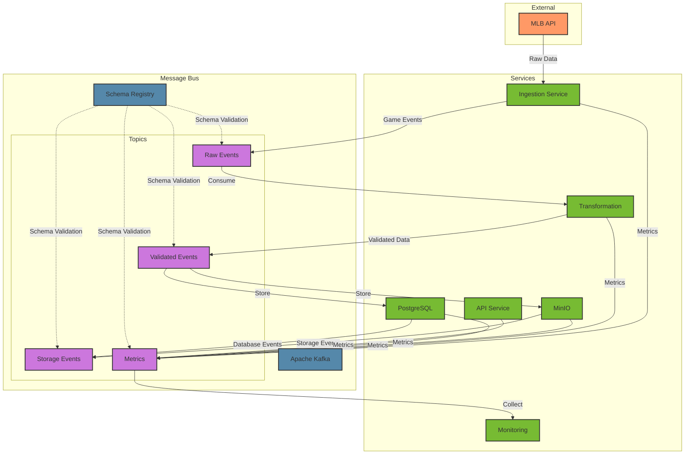

# Message Bus Implementation Plan

## Overview
This document outlines the implementation plan for integrating Apache Kafka as the message bus system into the MLB Statistics Tracking System (STS). The message bus will facilitate real-time data flow, event-driven architecture, and system-wide monitoring.

## Directory Structure
```
dsuite/
├── services/
│   ├── kafka/                      # Message bus service
│   │   ├── Dockerfile
│   │   ├── config/
│   │   │   ├── server.properties   # Broker configuration
│   │   │   └── topics.json        # Topic definitions
│   │   └── init/
│   │       └── create-topics.sh    # Topic initialization
│   │
│   ├── schema-registry/           # Avro schema registry
│   │   ├── Dockerfile
│   │   └── config/
│   │       └── schema-registry.properties
│   │
│   ├── ingestion/
│   │   └── src/
│   │       └── messaging/         # Messaging integration
│   │           ├── producers.py
│   │           ├── consumers.py
│   │           ├── schemas/
│   │           └── handlers.py
│   │
│   ├── transformation/
│   │   └── src/
│   │       └── messaging/         # [Similar structure]
│   │
│   ├── minio/
│   │   └── src/
│   │       └── messaging/         # Storage event integration
│   │
│   ├── postgres/
│   │   └── src/
│   │       └── messaging/         # Database event integration
│   │
│   ├── api/
│   │   └── src/
│   │       └── messaging/         # [Similar structure]
│   │
│   └── monitoring/               # Centralized monitoring
│       └── src/
│           ├── collectors/       # Metric collectors
│           └── alerts/          # Alert configurations
│
└── libs/
    └── messaging/               # Shared messaging utilities
        ├── config.py
        ├── retry.py
        └── schemas/            # Shared Avro schemas
```

## Architecture



## Topic Structure

### 1. Raw Events
```
mlb-sts/
├── raw/
│   ├── games/                 # Raw game events
│   ├── schedules/            # Schedule updates
│   └── metadata/             # Game metadata
```

### 2. Validated Events
```
mlb-sts/
├── validated/
│   ├── games/                # Validated game data
│   └── corrections/          # Data corrections
```

### 3. Storage Events
```
mlb-sts/
├── storage/
│   ├── minio-ops/           # MinIO operations
│   └── postgres-ops/        # PostgreSQL operations
```

### 4. System Events
```
mlb-sts/
├── system/
│   ├── commands/            # Service commands
│   └── health/             # Health checks
```

## Implementation Details

### 1. Message Schemas
All messages use Apache Avro schemas for:
- Type safety
- Schema evolution
- Efficient serialization
- Backward/forward compatibility

Example Game Event Schema:
```json
{
  "type": "record",
  "name": "GameEvent",
  "namespace": "mlb.sts.events",
  "fields": [
    {"name": "game_id", "type": "string"},
    {"name": "event_type", "type": "string"},
    {"name": "timestamp", "type": "long"},
    {"name": "payload", "type": "bytes"},
    {"name": "version", "type": "string"}
  ]
}
```

### 2. Service Integration

#### Producers
```python
@dataclass
class GameEvent:
    game_id: str
    event_type: str
    timestamp: datetime
    payload: Dict[str, Any]
    version: str

class MLBEventProducer:
    def publish_game_event(self, event: GameEvent) -> None:
        """Publishes game events to Kafka."""
```

#### Consumers
```python
class DataTransformer:
    async def process_game_events(self) -> None:
        """Consumes raw game events and produces validated data."""
```

### 3. Error Handling
- Retry mechanisms with exponential backoff
- Dead letter queues for failed messages
- Error logging and alerting
- Circuit breakers for downstream services

### 4. Monitoring
- Message throughput metrics
- Consumer lag monitoring
- Error rate tracking
- Service health checks
- Custom Grafana dashboards

## Deployment

### Docker Compose Configuration
```yaml
version: '3.8'
services:
  kafka:
    build: ./services/kafka
    environment:
      KAFKA_ADVERTISED_LISTENERS: PLAINTEXT://kafka:9092
      KAFKA_ZOOKEEPER_CONNECT: zookeeper:2181

  schema-registry:
    build: ./services/schema-registry
    environment:
      SCHEMA_REGISTRY_KAFKASTORE_BOOTSTRAP_SERVERS: kafka:9092

  # Other services configured with Kafka connection details
```

### Environment Variables
```bash
KAFKA_BOOTSTRAP_SERVERS=kafka:9092
SCHEMA_REGISTRY_URL=http://schema-registry:8081
KAFKA_CONSUMER_GROUP_ID=mlb-sts-${SERVICE_NAME}
KAFKA_AUTO_OFFSET_RESET=earliest
```

## Testing Strategy

### 1. Unit Tests
- Producer/consumer logic
- Message serialization/deserialization
- Error handling mechanisms

### 2. Integration Tests
- End-to-end message flow
- Schema evolution scenarios
- Error recovery patterns

### 3. Performance Tests
- Message throughput
- Latency measurements
- Recovery time objectives

## Migration Plan

1. **Phase 1: Infrastructure Setup**
   - Deploy Kafka and Schema Registry
   - Create initial topics
   - Set up monitoring

2. **Phase 2: Service Integration**
   - Integrate each service one at a time
   - Start with non-critical paths
   - Gradually increase message flow

3. **Phase 3: Production Deployment**
   - Full load testing
   - Failover testing
   - Production deployment

## Maintenance

### 1. Monitoring
- Kafka Manager UI for cluster management
- Grafana dashboards for metrics
- Alerting for critical issues

### 2. Backup Strategy
- Regular topic backups
- Schema registry backups
- Recovery procedures

### 3. Scaling
- Partition strategy
- Consumer group design
- Resource allocation
