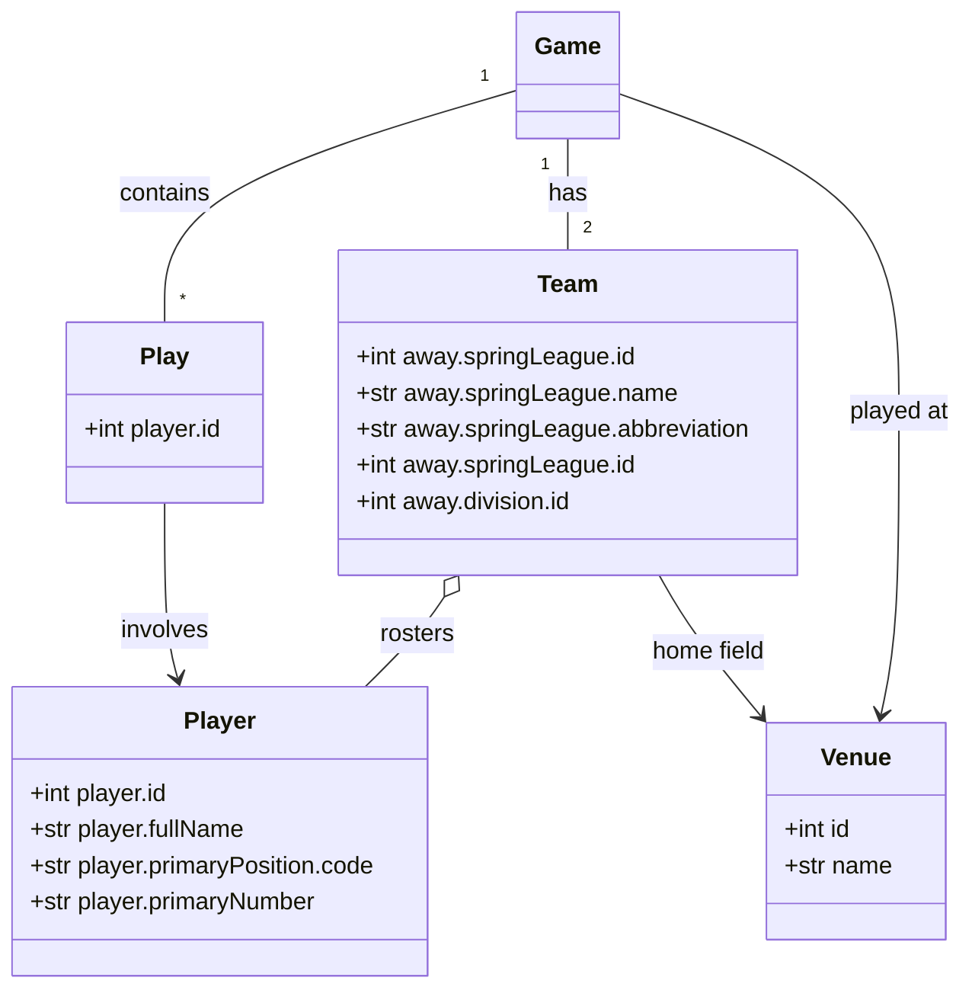

```mermaid
classDiagram
    %% MLB Game Data Schema
    %% Essential entities and relationships
    direction TB
    %% Central entity representing a baseball game
    class Game {
    }

    %% Baseball team participating in games
    class Team {
        +int away.springLeague.id
        +str away.springLeague.name
        +str away.springLeague.abbreviation
        +int away.springLeague.id
        +int away.division.id
    }

    %% Baseball player on a team
    class Player {
        +int player.id
        +str player.fullName
        +str player.primaryPosition.code
        +str player.primaryNumber
    }

    %% Individual play within a game
    class Play {
        +int player.id
    }

    %% Stadium where games are played
    class Venue {
        +int id
        +str name
    }

    %% Essential relationships
    Game "1" -- "2" Team : has
    Game --> Venue : played at
    Team o-- Player : rosters
    Game "1" -- "*" Play : contains
    Play --> Player : involves
    Team --> Venue : home field
```
